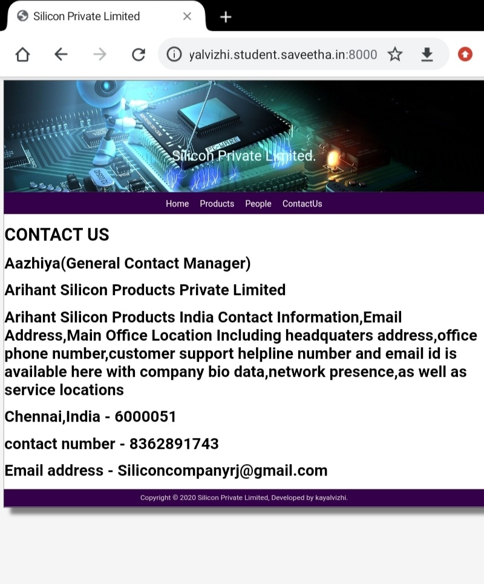
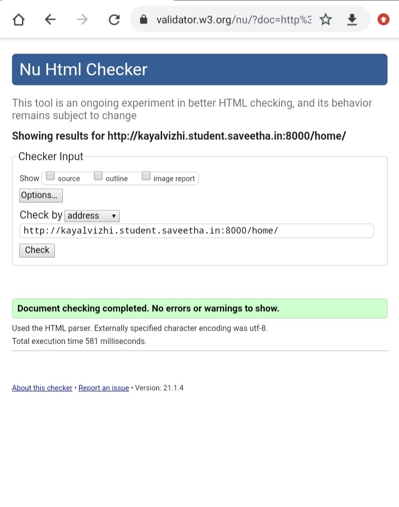
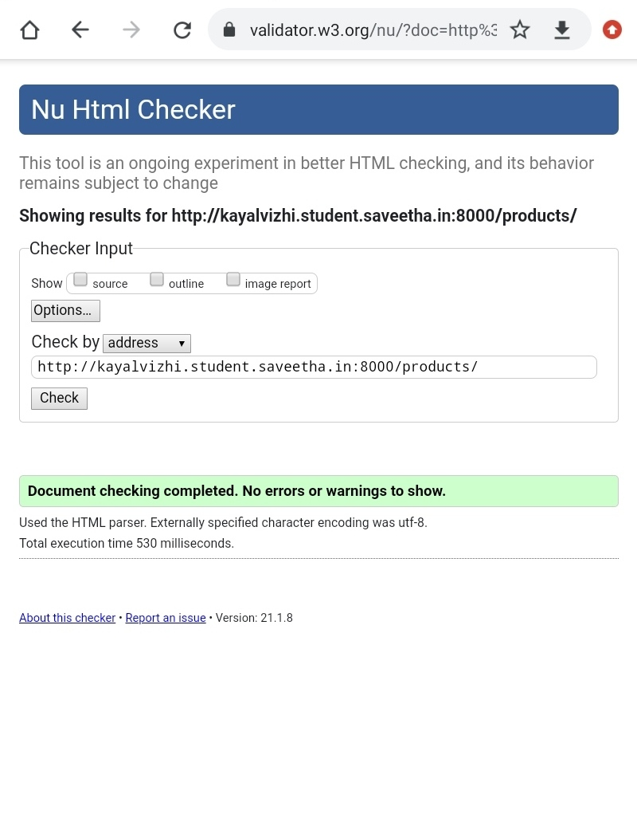
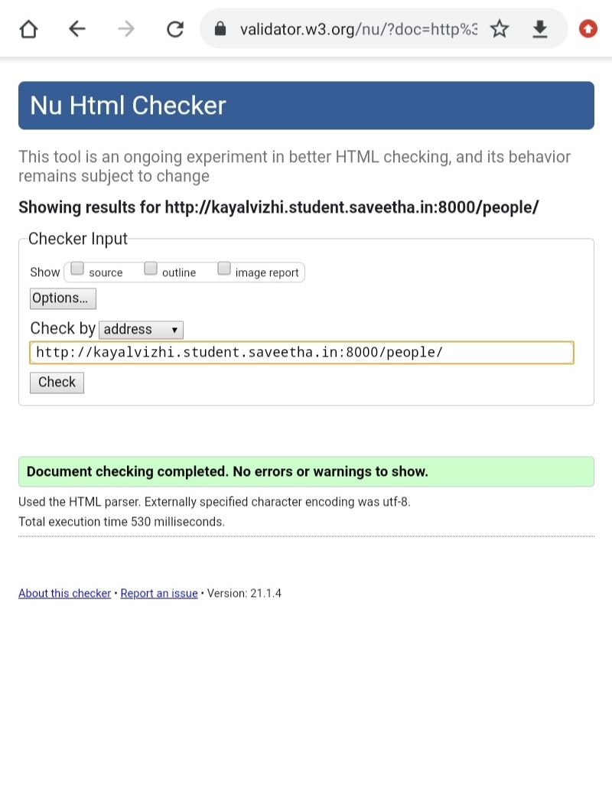

# Web Design for a Manufacturing Company
## AIM: 
To design a static website for a chip manufacturing company.

## DESIGN STEPS:
### Step 1: 
Requirement collection.
### Step 2:
Creating the layout using HTML and CSS.
### Step 3:
Updating the sample content.
### Step 4:
Choose the appropriate style and color scheme.
### Step 5:
Validate the layout in various browsers.
### Step 6:
Validate the HTML code.
### Step 6:
Publish the website in the given URL.

## PROGRAM:

### base.html
```

<!DOCTYPE html>
<html lang="en">

<head>
    <title>Silicon Private Limited</title>
    <link rel="stylesheet" href="">
    <link rel = "icon" href ="" type = "image/x-icon"> 
              
</head>

<body>
    <div class="container">
    <div class="banner">
        Silicon Private Limited.
    </div>
    <div class="menu">
        <div class="menuitem"><a href="/home">Home</a></div> 
        <div class="menuitem"><a href="/products">Products</a></div> 
        <div class="menuitem"><a href="/people">People</a></div>
        <div class="menuitem"><a href="/contactus>Contactus</a></div> 
    </div><div class="content">
        
    
    </div>
    <div class="footer">
        Copyright © 2020 Silicon Private Limited, Developed by kayalvizhi.
    </div>
    </div>
</body>

</html>
```

### home.html
```



    <div class="homecontent">    
    <h1>About Us</h1>
    
    <div class="contenttext">
    Silicon Pvt Ltd, provides a broad range of semiconductor and infrastructure software applications. Some of Silicon's core technologies and products include:
    <ul>
        <li>Memory Chips</li>
        <li>SATA HDD</li>
        <li>SATA SSD </li>
        <li>Broadband Modems</li>
        <li>Wifi Devices</li>
        <li>Switching Devices</li>
        <li>Optical Sensors</li>
    </ul> 
    </div>
    </div>

```
### products.html
```



    <div class="productcontent">    
    <h1>Our Premium Products</h1>
    <div class="productitems">
        <div class="productitem"> 
            <div class="itemimage">
            
            </div>
            <div class="itemname">4GB DDRA4 laptop memory</div>
            <div class="itemprice">Price: Rs.2000.00 </div>
        </div>
        <div class="productitem"> 
            <div class="itemimage">
            
            </div>
            <div class="itemname">1TB Laptop HDD</div>
            <div class="itemprice">Price: Rs.5000.00 </div>
        </div>
        <div class="productitem">
            <div class="itemimage">
            
            </div>
            <div class="itemname">2TB Laptop HDD</div>
            <div class="itemprice">Price: Rs.6858.00</div>
        </div>  
        <div class="productitem">
            <div class="itemimage">
            
            </div>
            <div class="itemimage">500GB Laptop,PC HDD</div>
            <div class="itemprice">Price: Rs.5299.00</div>
        </div>
        <div class='productitem">  
            <div class="itemimage">
            
            </div>
            <div class="itemimage">8GB DDR4 Laptop Memory</div>
            <div class="itemprice">Price: Rs.3000.00</div>
        </div>
        <div class="productitem">
            <div class="itemimage">
            
            </div>
            <div class="itemimage">12GB SD Memorycard</div>
            <div class="itemprice">Price: Rs.1249.00</div>
        </div>
        <div class="productitem">
            <div class="itemimage">
            
            </div>
            <div class="itemnamr">500GB Laptop HDD</div>
            <div class="itemprice">Price: Rs.2495.00</div>
        </div>
        <div class="productitem">
            <div class="itemimage">
            
            <div class="itemname">500GB 2.5inch Laptop HDD</div>
            <div class="itemprice">Price: Rs.2890.00</div>
        </div>
        <div class="productitem">
            <div class="itemimage">
            
            </div>
            <div class="itemname">160GB Laptop HDD</div>
            <div class="itemprice">Price: Rs.3000.00</div>
        </div>
        <div class="productitem">
            <div class="itemimage">
            
            </div>
            <div class="itemname">2.5inch HDD SDD for CD</div>
            <div class="itemprice">Price: Rs.345.00</div>
        </div>
        <div class="productitem">
            <div class="itemimage">
            
            </div>
            <div class="itemname">1TB HDD External Portable Case</div>
            <div class="itemprice">Price: Rs.515.00</div>
        </div>
        <div class="productitem">
            <div class="itemimage">
            
            </div>
            <div class="itemname">320GB Laptop HDD</div>
            <div class="itemprice">Price: Rs.1499.00</div>
        </div>
    </div>
    </div>

```
### people.html
```



<div class="peoplecontent">
<h1>Crew of the company</h1>
<div class="people">
    <div class="crew">
        <div class="peopleimage">
         alt="people image">
    </div>
        <div class="personname">Angela Ahrendts</div>
        <div class="designation">Senior Vice President Retail</div>
    </div>
    <div class="crew">
        <div class="peopleimage">
         alt="people image">
    </div>
        <div class="personname">Jonathan Ive</div>
        <div class="designation">Senior Vice President Chief Design Officer</div>
    </div>
        <div class="crew">
        <div class="peopleimage">
        
    </div>
        <div class="personname">Luca Maestri</div>
        <div class='designation">Senior Vice President Chief Financial Officer</div>
    </div>
        <div class="crew">
        <div class="peopleimage">
        
    </div>
        <div class+"personname">Dan Riccio</div>
        <div class="designation">Senior Vice President Hardware Engineering</div>
    </div>
        <div class="crew">
        <div class="peopleimage">
        
    </div>
        <div class="personname">Bruce Sewell</div>
        <div class="designation">Senior Vice President General Counsel</div>
    </div>
        <div class="crew">
        <div class="peopleimage">
         alt="people image">
    </div>
        <div class="personname">Johny Srouji</div>
        <div class="designation">Senio Vice President General Counsel</div>
    </div>
</div>
</div>

```
### contactus.html
```



<div class="contactuscontent">
    <h1>CONTACT US</h1>
    <div class="contactustext">
        <h2>Aazhiya(General Contact Manager)</h2>
        <h2>Arihant Silicon Products Private Limited</h2>
        <h2>Arihant Silicon Products India Contact Information,Email Address, Main Office Location Including headquaters address,office phone number,customer support helpline number and email id is available here withcompany bio data,network presence,as well as service location</h2>
    </div>
</div>

```
## OUTPUT:




## CODE VALIDATION REPORT:







## RESULT:
Thus a website is designed for the chip manufacturing company and is hosted in the URL http://kayalvizhi.student.saveetha.in:8000/. HTML code is validated.